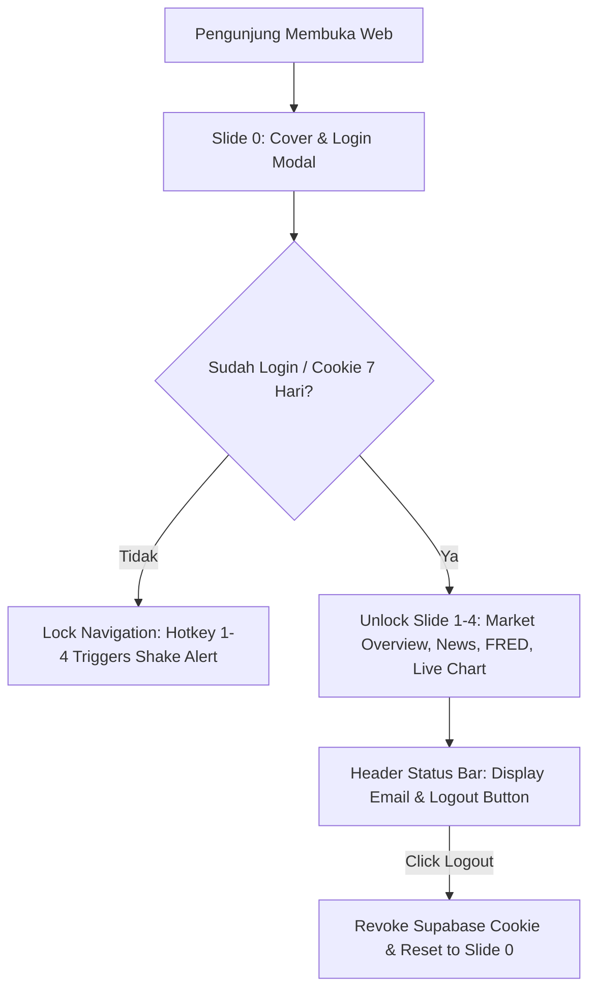

# Design Spec: Pre-Flight Verification & Graceful Fallback UI for ZenFX

## 1. Overview
Dokumen ini mendefinisikan strategi penanggulangan risiko error (*Error Mitigation Strategy*) serta desain antarmuka autentikasi (*UI Login Gate*) untuk deployment ZenFX ke publik via **Vercel / GCP Cloud Run + Supabase Auth**.

## 2. Selected Strategy: Option A (Pre-flight Verification + Graceful Fallback UI)

### A. Pre-Flight Verification Checklist
Sebelum melakukan `git push` dan deployment otomatis ke Vercel/GCP, developer dan CI/CD lokal menjalankan alur pengujian berikut:
1. **TypeScript & ESLint Audit**: `npm run lint` (memastikan 0 errors & 0 warnings).
2. **Automated Test Suite**: `npx jest` (memastikan 55/55 test pass di seluruh unit, integration, security, & perf test).
3. **Static Build Verification**: `npm run build` (memastikan kompilasi Next.js 14 App Router tidak memiliki error tipe atau missing exports).

### B. Graceful Fallback UI (Error Boundaries)
1. **API Error Handling**:
   - Jika `FINNHUB_API_KEY`, `FRED_API_KEY`, atau `GROQ_API_KEY` terputus/rate-limited, backend `app/api/*` mengembalikan status HTTP yang dikendalikan disertai objek data fallback terstruktur (`isDemoMode: true`).
   - UI menampilkan badge info ramah: `⚠️ Demo / Offline Mode` tanpa membuat komponen React terurai (*crash*).
2. **Next.js Global Error Boundaries**:
   - Menyediakan `app/global-error.tsx` dan `app/not-found.tsx` berdesain gelap (*dark theme*) yang konsisten dengan estetika ZenFX.

## 3. UI Login Authentication Design (Slide 0 Cover)

### A. Placement & Visual Aesthetics
- **Lokasi**: Integrated Card di `components/slides/cover-slide.tsx` (Slide 0).
- **Styling**: Dark Glassmorphism (`bg-zinc-900/60 backdrop-blur-md border border-amber-500/30`).
- **Modus Autentikasi (Multi-Email Support)**:
  - mendukung pendaftaran & login **banyak pengguna** (*multi-email sign-in & sign-up*).
  - **Toggle Form Mode**: Pilihan *"Sign In"* (Masuk) atau *"Sign Up"* (Daftar Akun Baru).
- **Elemen Input**:
  - Email Field (menerima email mana saja yang terdaftar di Supabase Auth)
  - Password Field (Password rahasia user)
  - Button *"Enter Private Suite"* / *"Create Account"* dengan efek hover gold gradient.

### B. Navigation & Hotkey Guardrails
- **Unauthenticated Access (State Locked)**:
  - Jika user belum terautentikasi dan menekan hotkey `1`–`4` atau mengeklik tombol navigasi slide, sistem melakukan *Soft Lock*:
  - Card Login bergetar lembut (*Shake Micro-animation*) dengan pesan notifikasi:
    > *"⚠️ Silakan login terlebih dahulu untuk membuka Private Suite"*

### C. Session Management & Header Badge
- **Session Persistence**: Menggunakan Supabase Auth Cookie yang bertahan selama **7 hari** (atau hingga logout).
- **Top Bar Badge**: Setelah login berhasil, status bar pojok kanan atas menampilkan:
  - Email Pengguna + Badge `[Logout]` kecil.
  - Klik `[Logout]` menghapus session cookie Supabase dan mengembalikan aplikasi ke kondisi ter-lock di Slide 0.

## 4. System Architecture Flow Diagram

